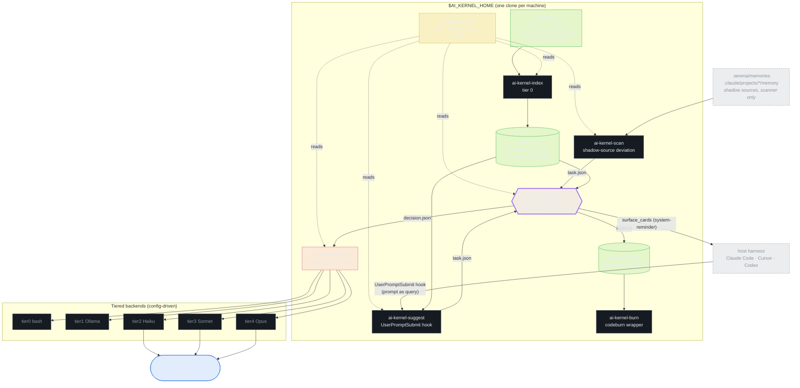
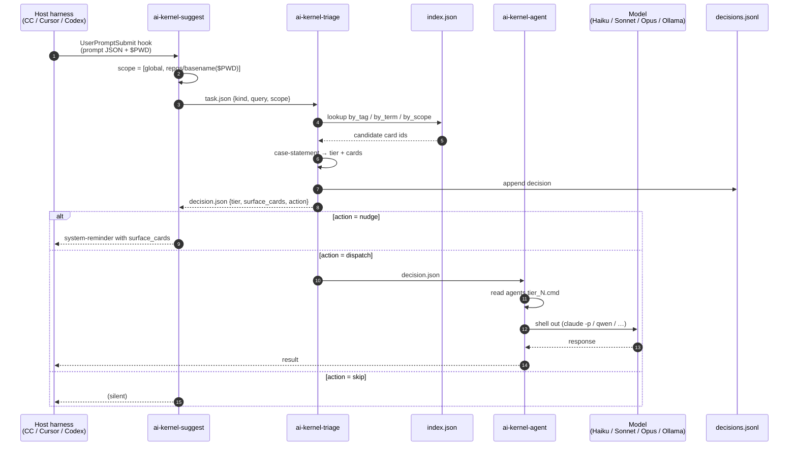
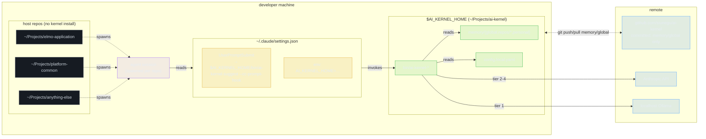

# AI Kernel — Architecture & Topology

Single-page entry point. For depth, see:

- [`PLAN.md`](../PLAN.md) — storage model, frontmatter spec, index format, triage contract, phased plan
- [`docs/superpowers/specs/2026-04-25-deployment-and-observability-design.md`](superpowers/specs/2026-04-25-deployment-and-observability-design.md) — C-global deployment, identity, scope filtering, observability

## 1. Components — what's in the box

## 2. Request flow — how a query moves

## 3. Deployment topology — C-global

## Key invariants

- **One kernel clone per machine.** No per-repo install. Host repos are untouched.
- **Memory is plain markdown + YAML.** Any agent can `cat memory/*.md` without the kernel.
- **The index is derived.** Delete `index.json` and `ai-kernel-index` rebuilds it.
- **Triage is the only decider.** It chooses tier, cards, and action — and may never spend more than `max_self_spend` on its own decision.
- **Engine is config-driven.** `agents.tier_N.cmd` swap = zero code change.
- **Scope-default for surfacing:** `[global, repos/basename($PWD)]`. `personal/` is opt-in.
